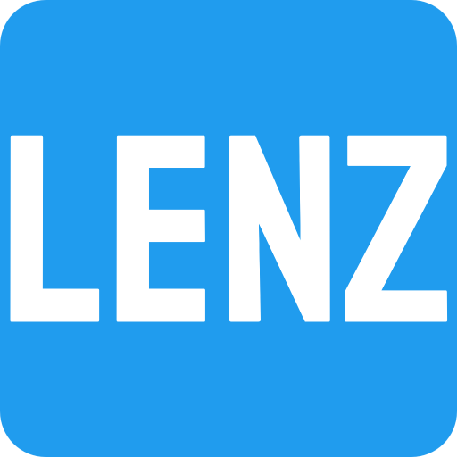

<!--
*** LENZ Encoders
-->

[![Contributors][contributors-shield]][contributors-url]
[![Forks][forks-shield]][forks-url]
[![Stargazers][stars-shield]][stars-url]
[![Issues][issues-shield]][issues-url]
[![MIT License][license-shield]][license-url]

<!-- PROJECT LOGO -->
 

  

  <h3 align="center">LENZ Encoders</h3>

  

    Miniature high-quality precise angle encoders
     
    <a href="https://github.com/lenzencoders"><strong>Explore LENZ Encoders »</strong></a>
     
     
    <a href="https://github.com/lenzencoders/Encoders_Description">View the encoder descriptions and specifications</a>
    ·
    <a href="https://github.com/lenzencoders/issues">Report Bug</a>
    ·
    <a href="https://github.com/lenzencoders/issues">Request Feature</a>
  

<!-- TABLE OF CONTENTS -->

  
Table of Contents

  <ol>
    <li>
      <a href="#about-the-encoders">About The Project</a>
      <ul>
        <li><a href="#features">Features</a></li>
        <li><a href="#applications-variety">Applications variety</a></li>
        <li><a href="#additional-functions">Additional functions</a></li>
      </ul>
    </li>
    <li><a href="#can-be-implemented-on-demand">Can be implemented on demand</a></li>
     <li><a href="#contact">Contact</a></li>
  </ol>

<!-- ABOUT THE ENCODERS -->
## About The Encoders
LENZ Encoders are non-contact bearingless absolute angle encoders. Two printed circuit board design is perfect to match wide variety of control and measurements applications with limited space. Precise position data up to 22 bits and reliable fast feedback in harsh environments.

LENZ encoders are inductive position sensors based on the physical principles of electromagnetic induction. Our encoders combine easy installation, low integration cost, high accuracy, stability over time, are extremely robust.

LENZ encoders are insensitive to electromagnetic fields, permanent magnets, power lines, parasitic capacitance, metallic parts and electrical noises.

[![LENZ Encoders IRS-I70 photo][product-photo]](https://lenzencoders.com)

### Features

* Robust ultra-lightweight design
* True absolute
* Resolution up to 22 bits
* Non-contact and bearingless
* Reliable feedback
* Simple installation
* Extended lifetime
* High speed operation
* Vast variety of sizes

(<a href="#top">back to top</a>)

### Applications variety

* Space-saving solution by virtue of compact size
* Meets high accuracy requirements
* Suited for high-speed control
* High reliability due to non-contact operating
* Compatibility with every BiSS C systems
* Cost-effective simple installation
* Wide variety of applications with electromagnetic field insensitivity

(<a href="#top">back to top</a>)

<!-- ADDITIONAL -->
### Additional functions

Every encoder support additional functions:

* Setting zero position
* Setting the direction of rotation
* Filtering customization 
* Running self-calibration function
* External isolated temperature sensor

## Can be implemented on demand

* Energy independent multiturn counter option 
* BiSS® Line interface
* Interfaces SSI, CAN, Modbus 
* A custom OEM design 

See the [open issues](https://github.com/lenzencoders/issues) for a full list of proposed features (and known issues).

(<a href="#top">back to top</a>)

<!-- CONTACT -->
## Contact

LENZ Encoders - info@lenzencoders.com

(<a href="#top">back to top</a>)

<!-- MARKDOWN LINKS & IMAGES -->
<!-- https://www.markdownguide.org/basic-syntax/#reference-style-links -->
[contributors-shield]: https://img.shields.io/github/contributors/lenzencoders/Encoders_Description.svg?style=for-the-badge
[contributors-url]: https://github.com/lenzencoders/graphs/contributors
[forks-shield]: https://img.shields.io/github/forks/lenzencoders/Encoders_Description.svg?style=for-the-badge
[forks-url]: https://github.com/lenzencoders/network/members
[stars-shield]: https://img.shields.io/github/stars/lenzencoders/Encoders_Description.svg?style=for-the-badge
[stars-url]: https://github.com/lenzencoders/stargazers
[issues-shield]: https://img.shields.io/github/issues/lenzencoders/Encoders_Description.svg?style=for-the-badge
[issues-url]: https://github.com/lenzencoders/issues
[license-shield]: https://img.shields.io/github/license/lenzencoders/Encoders_Description.svg?style=for-the-badge
[license-url]: https://github.com/lenzencoders/blob/master/LICENSE.txt
[linkedin-shield]: https://img.shields.io/badge/-LinkedIn-black.svg?style=for-the-badge&logo=linkedin&colorB=555
[linkedin-url]: https://linkedin.com/in/lenzencoders
[product-photo]: images/irs-i70_white.jpg